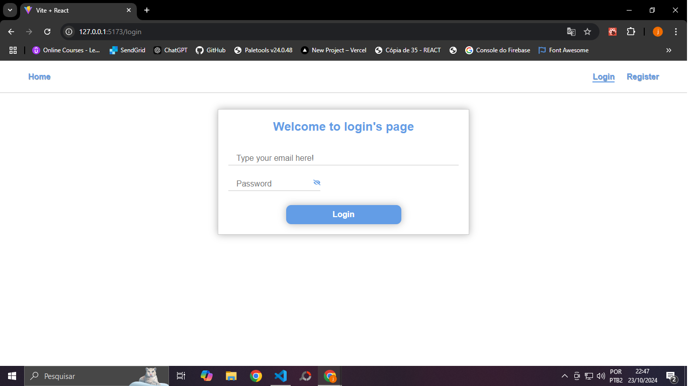
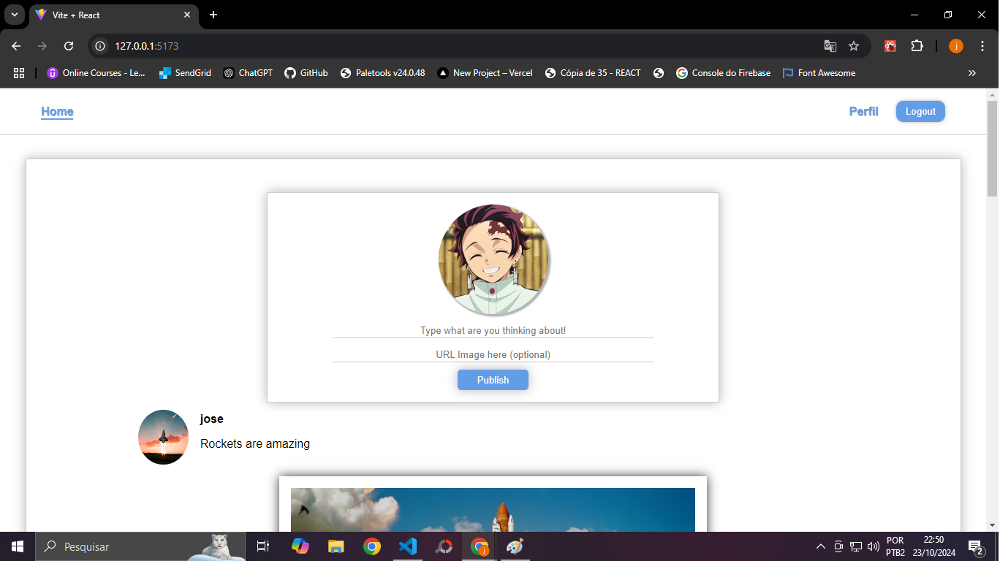
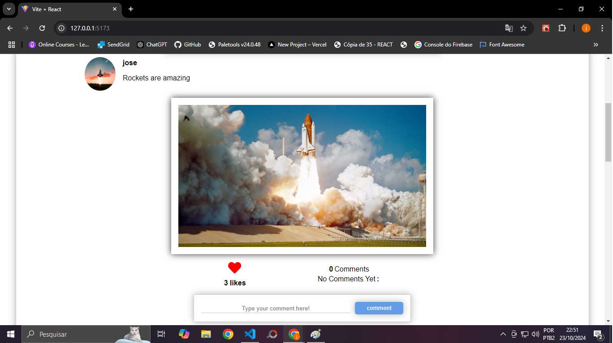
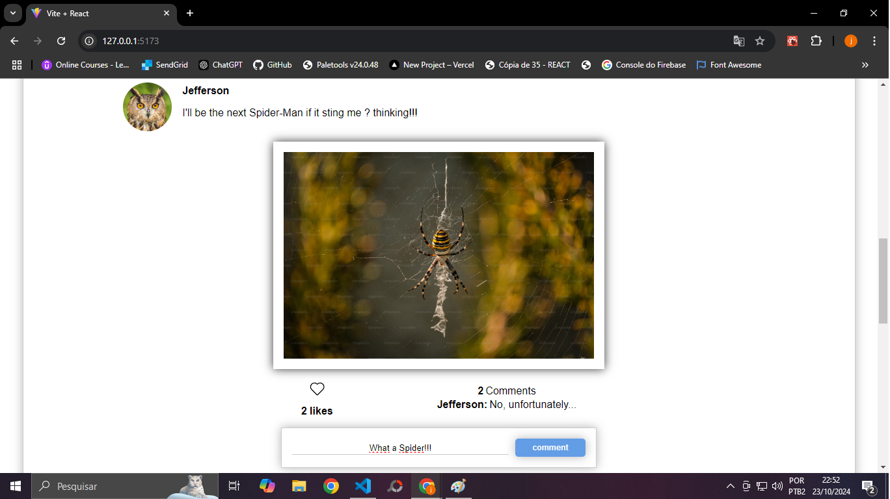
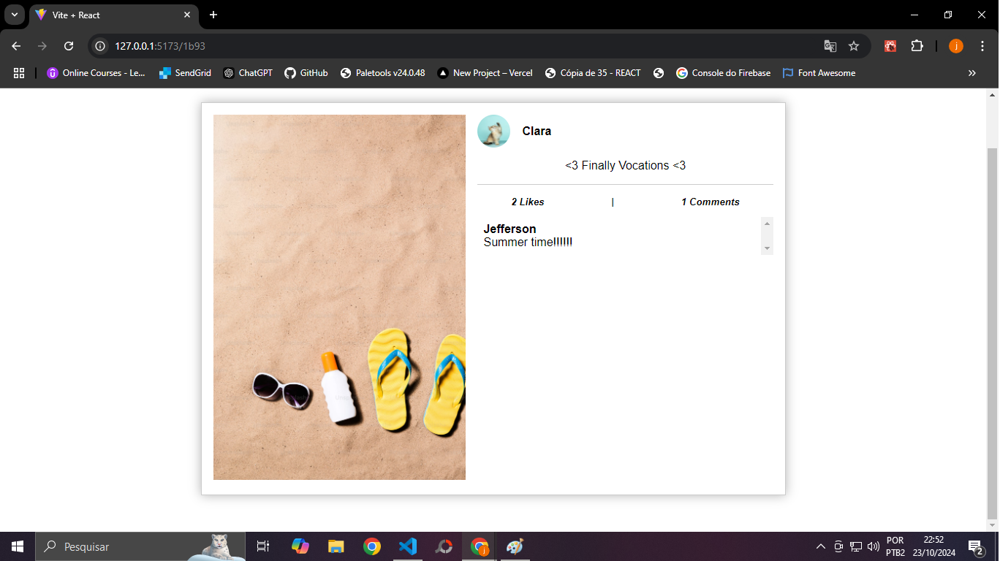

# Mini-Blog

## Descrição
O mini-blog foi o meu primeiro projeto realizado com REACT após ter conhecimento do mesmo.
Ele possui as funcionalidades básicas de uma rede social como publicação, realização e exibição de likes e comentários.
O mini-blog também possui um sistema de autenticação usando login e senha que utiliza o jsonwebtoken e json-server como pilares.

## Imagens do projeto

<details>
  <summary> Login </summary>
  
</details>

<details>
  <summary> Home </summary>
  
</details>

<details>
  <summary> Like </summary>
  
</details>

<details>
  <summary> Comment </summary>
  
</details>

<details>
  <summary> Opened Post </summary>
  
</details>

## Tecnologias utilizadas

### Front-end
- react-router-dom para roteamento
- react-icons para ícones

### Back-end
- bcrypt para hash e comparação de senhas
- cors para permitir acesso de outros dominios
- express para simplificação da criação das rotas e manipulação de requisição e respostas
- jsonwebtoken para geração e verificação e decodificação de tokens
- json-server para simular um banco de dados

## Como usar?
``` bash
1 - Clone o repositório
git clone https://github.com/jeffmazz/Mini-Blog.git
2 - abra um terminal na pasta auth localizada dentro da pasta frontend
3 - Instale as dependências
npm install
4 - execute o comando no terminal para iniciar o frontend
npm run dev
5 - abra um terminal na pasta backend e instale as dependências do backend
npm install
6 - acesse a pasta de backend no terminal e execute cada comando em três terminais diferentes
// execução do servidor
npm run serve
// execução dos posts
npm run posts
// execução dos usuários
npm run start
```

## Licença
- MIT
